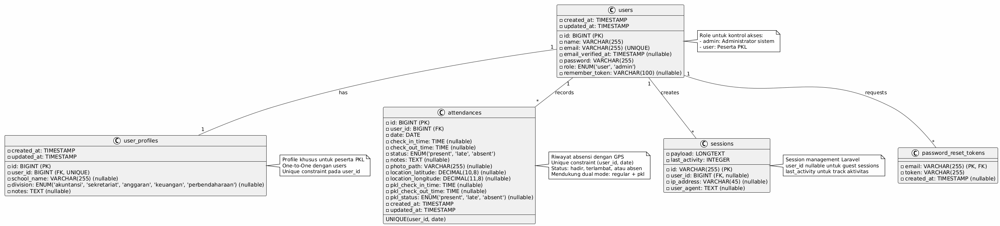

# Sistem Absensi PKL BPKAD Garut

## Tentang Website ku

Website ini adalah **Sistem Absensi Digital** yang dirancang khusus untuk memantau dan mengelola kehadiran peserta Praktik Kerja Lapangan (PKL) atau magang di BPKAD Garut.

Konsep utamanya adalah menciptakan solusi modern, akurat, dan transparan untuk manajemen kehadiran dengan mengintegrasikan **Validasi Lokasi Berbasis GPS (Geofencing)** dan **Bukti Foto Digital**. Peserta PKL hanya dapat melakukan absensi jika berada dalam radius yang telah ditentukan dari lokasi kantor, dan setiap absensi wajib menyertakan foto sebagai bukti kehadiran.

## Fitur Utama

### Autentikasi & Akun

-   Login Admin
-   Login Peserta PKL
-   Register User Baru
-   Password hashing dengan bcrypt
-   Session management yang aman
-   CSRF protection

### Untuk Admin

-   Dashboard dengan statistik real-time (Total Peserta, Hadir Hari Ini, Terlambat)
-   Kelola data peserta PKL (CRUD - Create, Read, Update, Delete)
-   Laporan absensi lengkap dengan filter per bidang penempatan dan tanggal
-   Pengaturan sistem dinamis:
    -   Set jam batas check-in
    -   Set lokasi geofencing (latitude, longitude, radius)
    -   Update alamat lokasi absensi
    -   Konfigurasi radius geofencing (default 500m)
-   Generate laporan (Excel, PDF, CSV)
-   Kelola akun peserta PKL
-   Tampil riwayat absensi seluruh peserta
-   Export data absensi dalam berbagai format

### Untuk Peserta PKL (User)

-   Check-in dan check-out dengan validasi GPS real-time
-   Capture foto otomatis saat absensi sebagai bukti
-   Lihat riwayat kehadiran pribadi dengan detail lengkap
-   Edit profile (nama, email, sekolah, bidang penempatan)
-   Filter riwayat absensi per tanggal
-   Deteksi otomatis status kehadiran (Hadir, Terlambat, Absen)
-   Notifikasi jika berada di luar area geofencing
-   Laporan personal kehadiran

### Fitur Keamanan & Validasi

-   **Geofencing**: Absensi hanya berlaku dalam radius 500m dari lokasi kantor
-   Validasi GPS real-time dengan akurasi tinggi
-   Distance calculation otomatis (haversine formula)
-   Status detection cerdas (Hadir, Terlambat, Absen)
-   Password hashing dengan bcrypt
-   CSRF protection & Session management
-   Verifikasi lokasi sebelum absensi
-   Bukti foto digital untuk setiap absensi
-   Pencegahan multiple check-in/out dalam waktu singkat
-   Logging aktivitas untuk audit trail

### Desain & User Experience

-   Modern UI dengan tema biru profesional
-   Responsive design (Mobile, Tablet, Desktop)
-   Gradient stat cards dengan smooth animations
-   Dark sidebar navigation untuk kemudahan akses
-   FontAwesome icons yang intuitif
-   Dashboard modern dan interaktif
-   Loading indicators untuk feedback UX
-   Form validation real-time
-   Toast notifications untuk konfirmasi aksi
-   Adaptif dengan berbagai ukuran layar dan orientasi perangkat

---

## Akun Default untuk Testing

### Admin

-   Email: admin@bpkad.local
-   Password: admin123

### Peserta PKL

-   Email: karyawan1@bpkad.local
-   Password: password123

---

## Prasyarat & Teknologi

-   PHP 8.2.12 atau lebih baru
-   Laravel 12.37.0
-   MySQL/MariaDB
-   Composer
-   Node.js & NPM
-   Browser modern dengan dukungan Geolocation API
-   Smartphone dengan GPS aktif (untuk pengujian di lapangan)

## Instalasi

### 1. Clone Repositori

```bash
git clone https://github.com/tatalenggana/absen-bpkad.git
cd absen-bpkad
```

### 2. Install Dependensi

```bash
composer install
npm install
```

### 3. Setup Environment

```bash
cp .env.example .env
php artisan key:generate
```

### 4. Konfigurasi Database

Edit file `.env` dan sesuaikan konfigurasi database:

```
DB_DATABASE=absensi_bpkad
DB_USERNAME=root
DB_PASSWORD=
```

### 5. Jalankan Migration & Seeding

```bash
php artisan migrate --seed
```

### 6. Build Assets

```bash
npm run dev
```

### 7. Jalankan Development Server

```bash
php artisan serve
```

Aplikasi akan berjalan di `http://localhost:8000`

Catatan: Pastikan koordinat lokasi geofencing sudah diatur di halaman Admin Settings sebelum melakukan testing absensi.

---

## Struktur Database

### Entity Relationship Diagram (ERD)


#### Penjelasan Singkat ERD

Diagram ini menunjukkan tabel-tabel utama dan hubungan di antara mereka:

-   **`users`**: Menyimpan data dasar pengguna sistem
    -   **Kolom Penting:** `id` (PK), `nama`, `email`, `password`, `role` (admin/user)
-   **`user_profiles`**: Menyimpan informasi profil tambahan
    -   **Hubungan:** **One-to-One** dengan `users`
    -   **Kolom Penting:** `user_id` (FK), `school_name`, `division`, `notes`
-   **`attendances`**: Menyimpan catatan absensi pengguna
    -   **Hubungan:** **One-to-Many** dengan `users`
    -   **Kolom Penting:** `user_id` (FK), `date`, `check_in_time`, `check_out_time`, `location_latitude`, `location_longitude`, `status`, `photo_path`
    -   **Constraint:** Unique pada `(user_id, date)` - satu user hanya bisa absen 1x per hari

**Inti:** Satu **User** → satu **User Profile** + banyak **Attendances**

---

### UML Class Diagram



---

## **Penjelasan UML Use Case Diagram - Attendance System**

### **Actors (Pelaku)** 👥

    -   Relasi **1-to-1** dengan `user_profiles`
    -   Relasi **1-to-many** dengan `attendances` dan `sessions`

-   **`User_profiles`**: Detail profil pe   serta PKL

    -   Unique constraint pada `user_id` (one-to-one relationship)
    -   Menyimpan sekolah, bidang penempatan, catatan

-   **`Attendances`**: Catatan absensi dengan GPS & Foto

    -   Status: `present`, `late`, `absent`
=======
1. **Guest** 👤 - Pengunjung yang belum login
2. **User** 👨‍💼 - Karyawan/staff yang sudah login
3. **Admin** 👨‍💼 - Administrator sistem

---

### **Fitur Guest** 🔓

- **Login** - Masuk ke sistem dengan email & password
- **Register** - Daftar akun baru

---

### **Fitur User** ✅

**Dashboard & Profile:**
- **View Dashboard** - Lihat dashboard pribadi & riwayat absensi
- **View Profile** - Lihat profil & data diri

**Attendance:**
- **Check In** - Absen masuk (validasi lokasi & waktu)
- **Check Out** - Absen pulang

**Authentication:**
- **Logout** - Keluar dari sistem

---

### **Fitur Admin** 👨‍💻

**Dashboard & Reports:**
- **View Dashboard** - Dashboard admin dengan overview attendance
- **View Attendance Report** - Laporan absensi lengkap semua user
- **Filter by Date** - Filter absensi berdasarkan tanggal tertentu
- **Filter by Month** - Filter absensi berdasarkan bulan
- **View User History** - Lihat riwayat absensi per user

**Settings:**
- **Manage Settings** - Akses halaman pengaturan
- **Update Deadline** - Update batas waktu check-in/check-out
- **Update Location** - Update lokasi kantor untuk validasi GPS

**Authentication:**
- **Logout** - Keluar dari sistem

---

### **Alur Sistem** 🔄

**Registration & Login:**
```
Guest → Register → Create account → Login → Redirect to Dashboard
                                           ↓
                                    Check role:
                                    - Admin → Admin Dashboard
                                    - User → User Dashboard
```

**User Check-in Flow:**
```
User → Click Check In → Validate:
                        - Sudah check-in hari ini?
                        - Lokasi dalam radius kantor?
                        - Waktu sesuai deadline?
                              ↓
                        Valid → Save to database
                              ↓
                        Invalid → Return error message
```

**Admin Filter Flow:**
```
Admin → Select filter (Date/Month) → Query database → Display results
```

---

### **Middleware & Authorization** 🔒

**Route Protection:**
```
Request → Check middleware:
          - guest: Hanya untuk yang belum login
          - auth: Harus login dulu
          - user: Khusus role user
          - admin: Khusus role admin
                    ↓
          Valid → Access granted
                    ↓
          Invalid → Redirect to login/unauthorized
```

**Role Check:**
- `isAdmin()` - Cek apakah user punya role admin
- Auto redirect sesuai role setelah login

---

### **Database Relations** 🗄️

```
users ──── attendances (1:N)
  ↓
role: admin/user

settings (untuk deadline & location)
```

---

### **Key Features** ⭐

✅ **Role-based Access Control** - Admin & User punya akses berbeda
✅ **GPS Validation** - Check-in harus di lokasi kantor
✅ **Time Validation** - Sesuai deadline yang diset admin
✅ **Attendance History** - Track semua absensi user
✅ **Flexible Settings** - Admin bisa update deadline & lokasi
✅ **Report & Filter** - Filter absensi by date/month

---

### Tabel Utama

-   **users** - Data pengguna (admin & peserta PKL)
-   **user_profiles** - Detail profile peserta (sekolah, bidang penempatan)
-   **attendances** - Riwayat absensi (check-in/out, foto, GPS, status)
-   **sessions** - Session management

## Struktur Folder

```
absen-bpkad/
├── app/
│   ├── Http/
│   │   ├── Controllers/
│   │   │   └── AttendanceController.php
│   │   │   └── AuthController.php
│   │   └── Middleware/
│   │       ├── AdminMiddleware.php
│   │       └── UserMiddleware.php
│   └── Models/
│       ├── User.php
│       ├── UserProfile.php
│       └── Attendance.php
├── database/
│   ├── migrations/
│   ├── seeders/
│   │   └── DatabaseSeeder.php
│   └── factories/
├── resources/
│   ├── views/
│   │   ├── auth/
│   │   ├── user/
│   │   ├── admin/
│   │   └── components/
│   ├── css/
│   └── js/
├── routes/
│   └── web.php
├── public/
├── storage/
├── .env.example
└── README.md
```

## Pembuat

**Gista Nuru Arifah Putri Lenggana**

Sistem Absensi PKL BPKAD Garut - 2025
